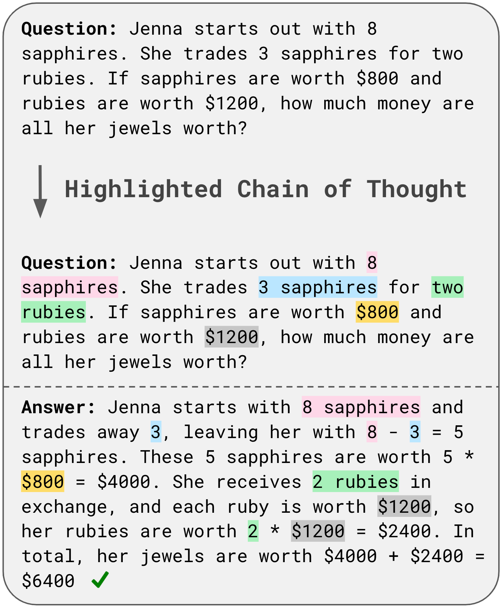

# 🔮 Fine-Tuned Qwen2.5-1.5B with PEFT (LoRA)

This repository contains PEFT adapter weights fine-tuned from the base model [`Qwen/Qwen2.5-1.5B`](https://huggingface.co/Qwen/Qwen2.5-1.5B) using [LoRA (Low-Rank Adaptation)](https://github.com/huggingface/peft). Only the adapter weights are included here.

## 🧾 Model Details

- **Base Model**: Qwen/Qwen2.5-1.5B
- **Fine-Tuning Method**: LoRA (via 🤗 PEFT)
- **Library Versions**:
  - `transformers >= 4.36.0`
  - `peft >= 0.10.0`
  - `accelerate >= 0.21.0`
- **Use Case**: Instruction following / downstream adaptation

## Input Output Detail
<div align="center">    

</div>

## 💡 Usage

To load and use this adapter:

```python
from peft import PeftModel, PeftConfig
from transformers import AutoTokenizer, AutoModelForCausalLM

# Paths
base_model = "Qwen/Qwen2.5-1.5B"
MODEL_PATH = "your-username/your-repo-name"  # replace with your trained model path

tokenizer = AutoTokenizer.from_pretrained(base_model_name)
    tokenizer.pad_token = tokenizer.eos_token
    
    # Load the base model
    model = AutoModelForCausalLM.from_pretrained(
        base_model_name,
        torch_dtype=torch.float16,
        device_map="auto"
    )
    
    # Load the PEFT configuration and adapter weights
    peft_config = PeftConfig.from_pretrained(MODEL_PATH)
    model = PeftModel.from_pretrained(model, MODEL_PATH)
    model.config.pad_token_id = tokenizer.pad_token_id
    model.eval()
    
    print(f"Model loaded successfully from {MODEL_PATH}")

def build_prompt(question: str) -> str:
    return f"<question>{question}</question>\n<answer>"

# Function to generate response with fact span tagging
def generate_response_with_fact_spans(question, model, tokenizer, max_length=512):
    """
    Generate a response with fact span tags for the given question.
    
    Args:
        question: The input question
        model: The fine-tuned model
        tokenizer: The tokenizer
        max_length: Maximum length of the generated response
        
    Returns:
        Generated response with fact span tags
    """
    
    prompt = build_prompt(question)
    input_ids = tokenizer.encode(prompt, return_tensors="pt").to(model.device)
    
    # Generate output
    with torch.no_grad():
        output = model.generate(
            input_ids,
            max_length=max_length,
            temperature=0.7,
            do_sample=True,
            top_p=0.9,
            pad_token_id=tokenizer.eos_token_id,
        )
    
    # Decode the output
    response = tokenizer.decode(output[0], skip_special_tokens=True)
        
    return response
```

If you use this model, please cite:
```
@article{nguyen2025hot,
  title={HoT: Highlighted Chain of Thought for Referencing Supporting Facts from Inputs},
  author={Nguyen, Tin and Bolton, Logan and Taesiri, Mohammad Reza and Nguyen, Anh Totti},
  journal={arXiv preprint arXiv:2503.02003},
  year={2025}
}
```
